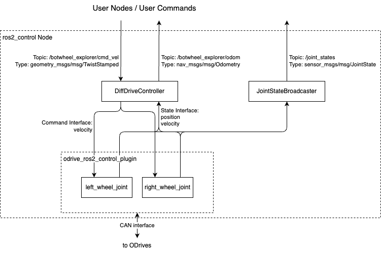

# BotWheel Explorer ROS2 Package

**Work In Progress**

This package contains:

- Hardware descriptor (URDF) files for the [BotWheel Explorer](https://shop.odriverobotics.com/products/botwheel-explorer).
- A launch file that allows to drive the robot around by sending `geometry_msgs/msg/TwistStamped` messages.

See also: [odrive_ros2_control](../odrive_ros2_control/README.md)

## Architecture

The system launched by `botwheel_explorer.launch.py` looks like this:




## Usage Instructions

This assumes that your ODrives are already configured (with `node_id` 0 and 1) according to the [docs](https://docs.odriverobotics.com/v/latest/guides/botwheel-explorer.html) and ready to go.

1. Clone this repository
   - Either into your existing [colcon workspace](https://colcon.readthedocs.io/en/released/user/what-is-a-workspace.html) if you have one. In this case run all following commands in your workspace.
   - Or as a standalone directory. In this case switch to the cloned directory and run all following commands from there.

1. Install Dependencies

   ```bash
   rosdep install --from-paths odrive_ros2_control odrive_botwheel_explorer -y --ignore-src
   ```

1. Build

   ```bash
   colcon build --symlink-install --packages-up-to odrive_botwheel_explorer
   ```

1. Launch

   ```bash
   source ./install/setup.sh
   ros2 launch odrive_botwheel_explorer botwheel_explorer.launch.py
   ```

   When the system finishes launching (may take a few seconds on a slow machine), the ODrives with `node_id` 0 and 1 should automatically go active.

   When you exit this command, the ODrives disarm if their watchdog was enabled.

1. Inspect that the topics are available

   ```
   $ ros2 control list_hardware_interfaces
   command interfaces
           left_wheel_joint/effort [available] [unclaimed]
           left_wheel_joint/position [available] [unclaimed]
           left_wheel_joint/velocity [available] [claimed]
           right_wheel_joint/effort [available] [unclaimed]
           right_wheel_joint/position [available] [unclaimed]
           right_wheel_joint/velocity [available] [claimed]
   state interfaces
           left_wheel_joint/effort
           left_wheel_joint/position
           left_wheel_joint/velocity
           right_wheel_joint/effort
           right_wheel_joint/position
           right_wheel_joint/velocity
   ```

   As you can see, there are two joints (two wheels) that have their `velocity` command interface claimed (by the DiffDriveController) and provide position and velocity feedback.

   ```
   $ ros2 topic list
   /botwheel_explorer/cmd_vel
   /botwheel_explorer/odom
   /botwheel_explorer/transition_event
   /diagnostics
   /dynamic_joint_states
   /joint_state_broadcaster/transition_event
   /joint_states
   /parameter_events
   /robot_description
   /rosout
   /tf
   /tf_static
   ```

1. Check ODrive feedback

   ```bash
   $ ros2 topic echo /joint_states
   ---
   header:
     stamp:
       sec: 1706131922
       nanosec: 319699404
     frame_id: ''
   name:
   - left_wheel_joint
   - right_wheel_joint
   position:
   - 56.5616569519043
   - .nan
   velocity:
   - 0.004984875209629536
   - .nan
   effort:
   - 9.469995711697266e-05
   - .nan
   ---
   ```

   In this example the right ODrive is disconnected, therefore its feedback shows as `.nan`.

1. Drive the robot around

   The following command makes the BotWheel Explorer go forward with `0.2 m/s` and turn right with `0.3 turns/s`.

   ```bash
   ros2 topic pub --rate 30 /botwheel_explorer/cmd_vel geometry_msgs/msg/TwistStamped "
       twist:
         linear:
           x: 0.2
           y: 0.0
           z: 0.0
         angular:
           x: 0.0
           y: 0.0
           z: 0.3"
   ```

   When you exit the command with Ctrl+C, the BotWheel Explorer comes to a halt.

## Troubleshooting

- Getting spammed with warnings like:

   ```
   [ros2_control_node-1] [WARN] [1706131056.848045848] [resource_manager]: (hardware 'DiffBot'): 'left_wheel_joint/effort' command interface not in available list. This should not happen (hint: multiple cleanup calls).
   [ros2_control_node-1] [WARN] [1706131056.848081755] [resource_manager]: (hardware 'DiffBot'): 'left_wheel_joint/velocity' command interface not in available list. This should not happen (hint: multiple cleanup calls).
   [ros2_control_node-1] [WARN] [1706131056.848096588] [resource_manager]: (hardware 'DiffBot'): 'left_wheel_joint/position' command interface not in available list. This should not happen (hint: multiple cleanup calls).
   ```

   This can mean that the CAN interface could not be opened. Check for `Failed to initialize SocketCAN on can0` in the beginning of the log.
   Make sure the CAN interface exists and is up (check with `ip link`).
